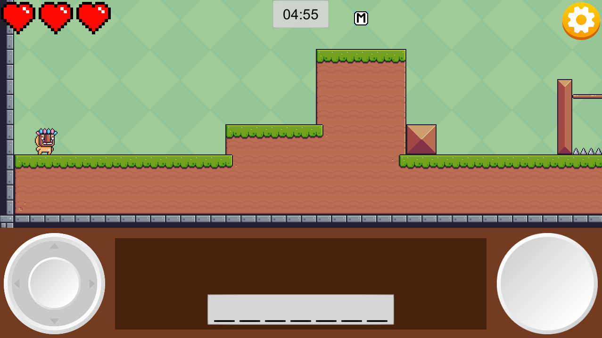
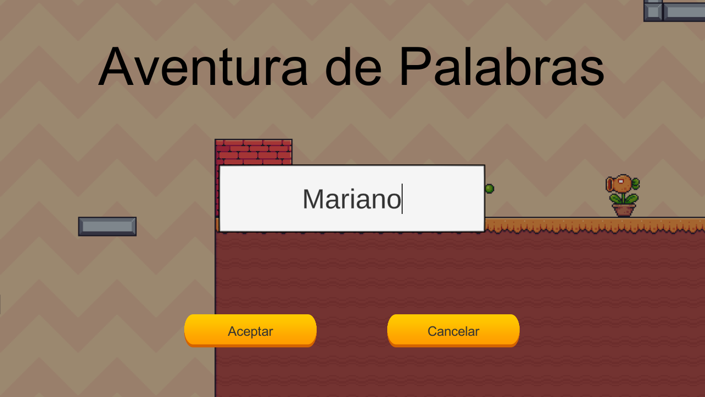
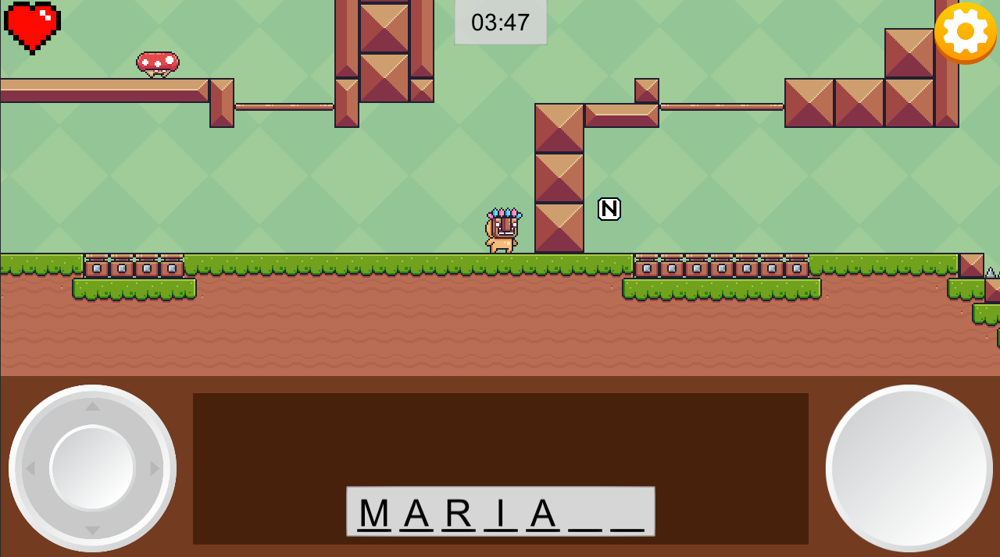
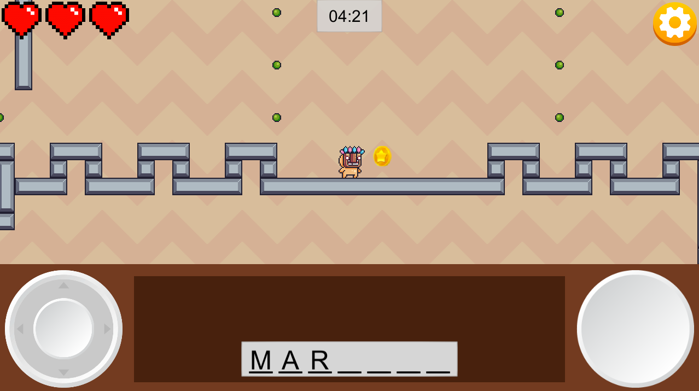
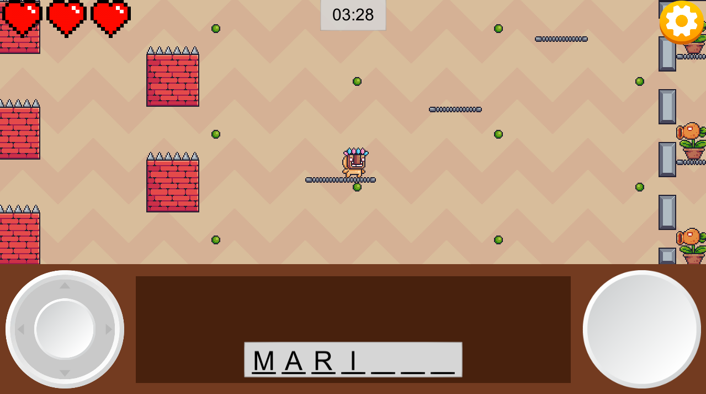

Prototipo de videojuego cuya finalidad es la de ayudar a los estudiantes a que aprendan a reconocer las letras presentes en su nombre.

El videojuego está desarrollado en Unity y tanto la música, los efectos de sonido y el arte utilizado fueron descargados gratuitamente del Unity Asset Store.

Para más información:
https://acytra.itch.io/aventura-de-palabras

**Imágenes:**

